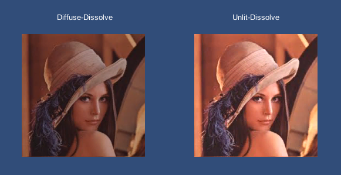
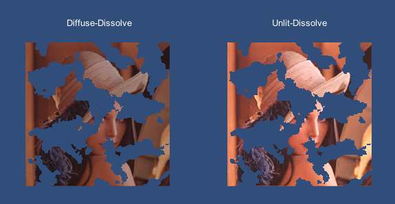

Unity-DissolveEffectSample
==========================

A dissolve shader effect sample.

Original Images
---------------

Dissolved Images
---------------

Currently supported dissolve shaders are:
* Diffuse
* Unlit

References
----------
* [LeanTween](https://github.com/dentedpixel/LeanTween) is used for the alpha animation.

License
-------

This code is distributed under the terms and conditions of the MIT license.

Copyright (c) 2013 Kim, Hyoun Woo